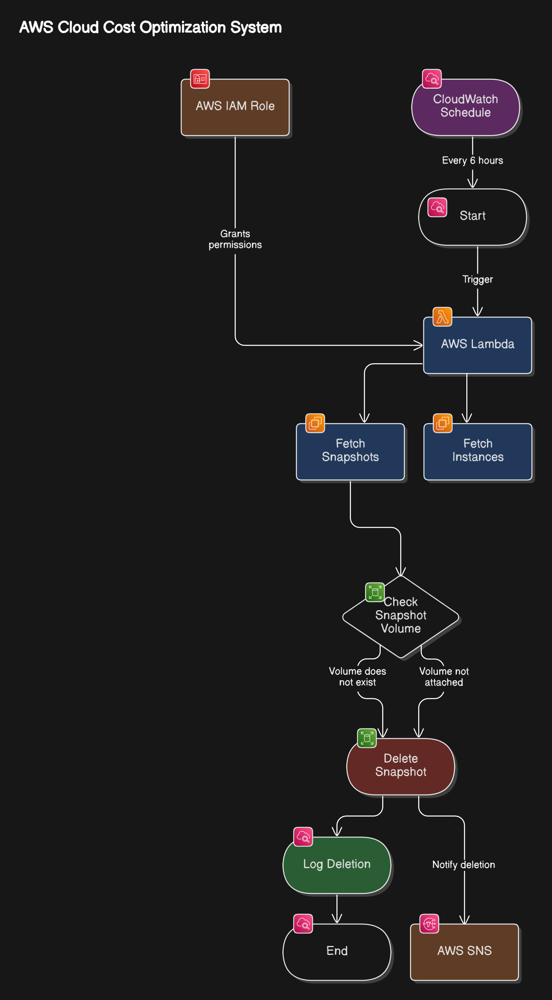

## AWS Cloud Cost Optimization - Identifying Stale Resources

### Identifying Stale EBS Snapshots

**Common Cloud Cost Pitfall: Unused Resources**

Consider a scenario where a developer provisions an EC2 instance with an EBS volume for backups. If they delete the instance but forget to delete the attached volume, AWS continues to charge for that unused volume, leading to unnecessary expenses.

In this example, we'll create an AWS Lambda function to identify and delete stale EBS snapshots that are no longer associated with any active EC2 instances. This helps reduce unnecessary storage costs.

### **Architecture of AWS Cost Optimization**

The **AWS Lambda function** automates **EBS snapshot lifecycle management** to optimize storage costs. The process follows these key steps:

1. **Snapshot Discovery:**

   - The function **fetches all EBS snapshots** owned by the AWS account (`self`).

2. **EC2 Instance & Volume Validation:**

   - It retrieves a **list of active EC2 instances** (both **running** and **stopped**).
   - The function checks if each snapshot’s **associated EBS volume exists** and whether it is **attached to an active EC2 instance**.

3. **Stale Snapshot Identification & Cleanup:**

   - If a snapshot belongs to a **volume that no longer exists** or is **not attached to any active instance**, it is marked as **stale**.
   - The function **deletes stale snapshots**, freeing up unused storage and reducing AWS costs.

4. **Logging & Notifications:**

   - All actions are **logged in Amazon CloudWatch** for monitoring.
   - AWS **SNS (Simple Notification Service)** sends alerts when snapshots are deleted, ensuring transparency and visibility.

5. **Automated Execution via EventBridge:**
   - AWS **EventBridge** triggers the Lambda function at scheduled intervals, enabling continuous cost optimization **without manual intervention**.

By implementing this architecture, the solution ensures **efficient storage management**, **automated cost savings**, and **seamless AWS resource optimization**.

### What Are Stale Resources and Their Impact?

Stale resources refer to unused or orphaned cloud resources that continue to incur costs. It is the responsibility of DevOps engineers to ensure cloud cost efficiency by identifying and cleaning up such resources.

### How DevOps Engineers Optimize Costs

1. **Monitoring & Alerts:**

   Use **AWS Simple Notification Service (SNS)** to notify teams about stale resources.

2. **Automated Cleanup:**

   If the DevOps engineer has the required permissions(In general they have), then they can automatically delete unused resources to reduce costs.

## Hands-On

### Implementing Cost Optimization with AWS Lambda

#### Architecture Overview

We use AWS Lambda to automate stale resource cleanup. The function:

- Uses Boto3 (AWS SDK for Python) to interact with AWS APIs.

- Identifies stale EBS snapshots.

- Deletes snapshots that are no longer associated with an active volume.

- Can be triggered using AWS CloudWatch Events for scheduled execution.

### Best Practices

Follow least privilege principles when granting IAM permissions.

Implement proper logging and monitoring to track deleted resources.

### Hands-On Implementation: Manual Approach:

Use AWS Console to identify and delete stale resources manually.

Validate cost savings via AWS Billing Dashboard.

#### AWS Lambda Execution Time

- Default execution time: 3 seconds

- Can be increased based on specific use cases.

## Automated Approach: Infrastructure Provisioning Using Terraform

Use Terraform for infrastructure provisioning.

Implement CloudWatch Events to trigger the Lambda function at regular intervals.

Automate notifications using SNS.
